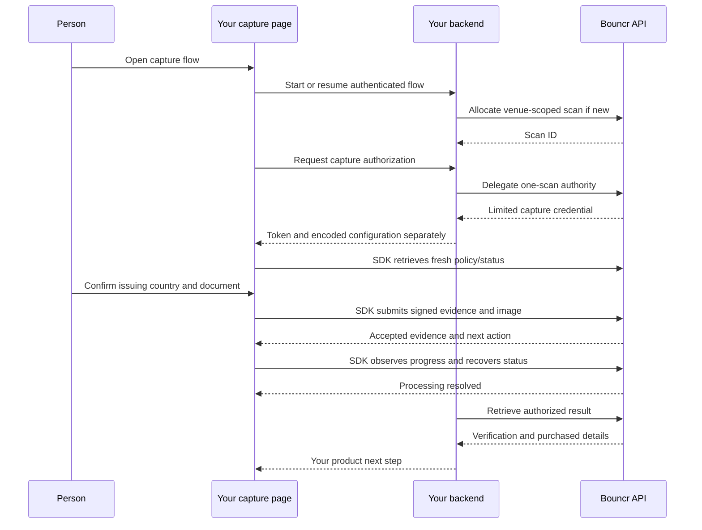

<Note>
  Draft integration guide for the private web SDK. Configuration and typed error interfaces marked planned are being finalized. Native iOS and Android packages are future deliveries.
</Note>

Bouncr provides a headless SDK that captures a physical identity document, reads its barcode or machine-readable zone (MRZ), and submits the evidence and images. Your application supplies the interface. Your backend chooses the venue and retrieves the authorized verification result.

Launch is camera-only, document-only, and online-first. There are no liveness checks. Mobile Safari and Android Chrome use the same web SDK as desktop browsers.

## What you build

1. A backend that obtains a scoped API credential and allocates a scan for an authorized venue.
2. A backend authorization handler that delegates access to that one scan for the current user.
3. A capture page that renders server-directed country/document choices, instructions, and lifecycle state.
4. A backend result handler that retrieves the completed scan and decides your next business action.

The SDK handles camera lifecycle, document analysis, evidence signing, uploads, recovery, and status observation. You do not implement OCR, barcode decoding, SSE reconnection, or evidence signatures.

## End-to-end flow

## Organization access and venues

An OAuth application is your organization integration identity. Its organization membership and venue grants determine which resources it may access. Its scoped bearer tokens determine which operations a particular credential may perform. Organization credentials do not depend on their creator remaining employed.

A venue groups scans and preferences. Your backend selects an authorized venue; an end-user page must not choose an arbitrary venue from an untrusted request. Platforms can organize customers into authorized venues, subject to granted access and their commercial agreement.

A Device records capture provenance and belongs to an actor. It is not an API credential. Bouncr establishes the capture Device when authorizing the signing key. Resuming a scan can replace active capture authority without changing the originating Device.

## Shared implementation across platforms

| Layer | Responsibility | Availability |
| --- | --- | --- |
| Rust core | Detector interpretation, quality, PDF417/MRZ processing policy, capture readiness | Private implementation |
| Rust external module | HTTP requests, authorization consumption, evidence signing, upload/retry, resume, SSE recovery | Implemented for web host |
| Web binding | Camera, inference runtime, image encoding and lifecycle bridge | Private launch implementation |
| Swift/iOS binding | Native primitives and packaging around shared core/external behavior | Planned |
| Kotlin/Android binding | Native primitives and packaging around shared core/external behavior | Planned |

Future native packages will expose the same logical lifecycle with platform-appropriate types. They are not available simply because Rust compiles for those targets. External integrations use HTTP/SSE; native gRPC remains an internal Bouncr application concern.

Future local identity parsing, SDK-managed reference data, and offline delivery are separate milestones. Launch integrators do not configure a SQLite database.

## Completion is not an approval

`onCaptureComplete` means required evidence and images have been durably accepted. `onComplete` means required server processing has resolved. Neither callback means that verification passed.

Your backend retrieves the authoritative result using separate result-read permission. The capture credential cannot list history or retrieve the final verification decision. Your application decides what to tell its end user afterward.

## Security boundary

Keep organization credentials and private client keys on your backend. Give the browser only its limited capture authority. Authenticate your own caller and authorize the exact scan before delegating or resuming access.

Evidence signatures bind submitted bytes and scan authority to the authorized capture key. They do not prove that browser code or camera input is unmodified. Embedding models in a package does not make them secret or attest client execution. Bouncr validates submitted evidence and computes the result on the server.
